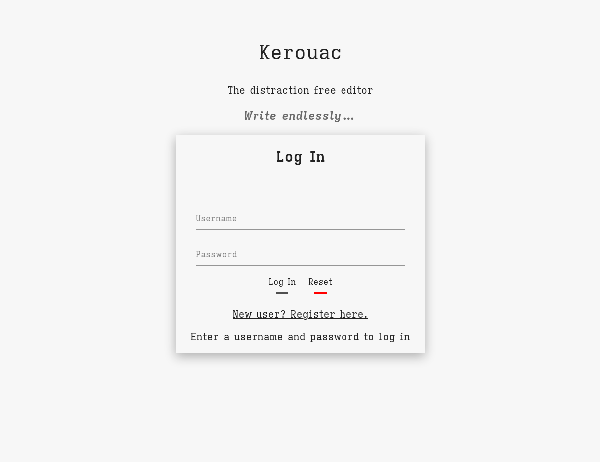
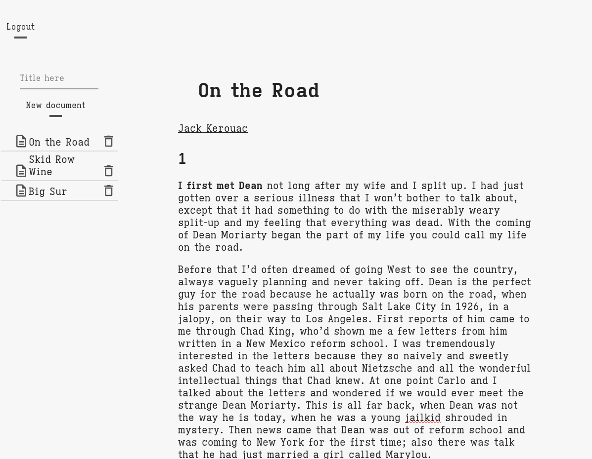
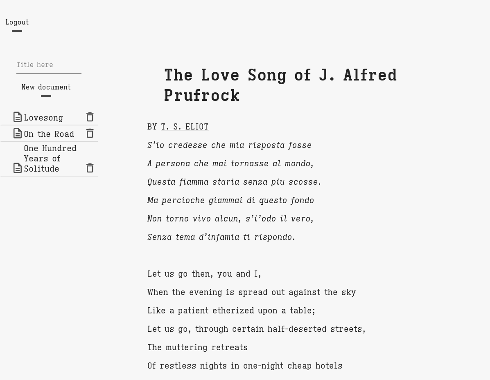

# Kerouac

A distraction-free, cross-platform markdown editor, inspired by Typora and iA Writer

Deployed at [https://kerouac-app.herokuapp.com/](https://kerouac-app.herokuapp.com/)

## Maintainer - Dominick DeLorenzo
[LinkedIn](https://www.linkedin.com/in/dominick-delorenzo-breed) | [Twitter](https://twitter.com/bad_mr_wolf) | [Github](https://github.com/domdelorenzo)


***
### ***Description***

Kerouac is a markdown editor for writers, academics, and engineers, designed to be:
* simple
* usable anywhere
* distraction free

Kerouac provides:
* WYSIWYG interface
* Markdown-like shortcuts for formatting
* Keybindings for formatting and saving

***

### ***Screenshots***

<div align="center">
  <pre>
    &nbsp;&nbsp;&nbsp;&nbsp;&nbsp;&nbsp;
  </pre>
</div>

***
### ***Technologies Used (MERN)***

This project uses the following technologies

- [MongoDB](https://www.mongodb.com/) for database [Mongoose](https://mongoosejs.com/)
- [Express.js](http://expressjs.com/) as Node web framework
- [React.js](https://reactjs.org) for client, [React Router](https://reacttraining.com/react-router/) v5 for routing
- [Node.js](https://nodejs.org/en/) for server
- [Slate](https://github.com/ianstormtaylor/slate) for rich text editing and rendering

### ***Project Status***

Refer to the project's [Trello page](https://trello.com/b/08z798iH/markdown-editor)

### ***Features***
- [x] Rich text formatting, (bold, italic, underlined, code, H1-H6, and block quotes)
- [x] keybindings for formatting and saving
- [x] User authentication
- [x] User document storage in app database
- [x] Document creation, saving, and deletion
- [x] Light/dark mode switching

### ***Future Updates***
- [ ] Local markdown file import
- [ ] Markdown file export to local storage
- [ ] Document Hierarchy Display
- [ ] Suport user-generated theming
- [ ] Display wordcount
- [ ] Hemingway mode (backspace key disabled)
- [ ] Focus mode
- [ ] Google Drive integration
- [ ] Dropbox integraition
- [ ] LaTeX and MathTex syntax support

### ***Containerization & Deployment***

- [x] Deployment (Heroku) [https://kerouac-app.herokuapp.com/](https://kerouac-app.herokuapp.com/)

## ***Quick Start***

* Click the *New User* registration link to create an account
* log in witn your username and password
* Enter a document title and click *New Document* to create a blank document
* Click the document in the left navigation panel to begin editing.
* Type Ctrl+'s' to save your work!

If self-hosting, you can clone this repository and run a development server using the following commands:

```javascript
// Install all dependencies for client & server
npm install

// Run client & development server with concurrently
npm dev

// Assumes Node and npm are installed on machine
// Server runs on http://localhost:3000 (default for Create React App)
```

***

### ***Credits***

Fonts: 
* [Iosevka Etoile](https://typeof.net/Iosevka/)
* [IBM Plex](https://www.ibm.com/plex/) (fallback)

Icons: [Material Icons](https://fonts.google.com/icons)

CSS pulse animation: [Florin Pop](https://www.florin-pop.com/blog/2019/03/css-pulse-effect/)

Rich Text CSS: [Slate Examples](https://www.slatejs.org/examples/)

App bootstrapping: [Create React App](https://github.com/facebook/create-react-app)

Theming: [Styled Components](https://styled-components.com/)

Dark mode inspiration: [CSS Tricks](https://css-tricks.com/a-dark-mode-toggle-with-react-and-themeprovider/)
